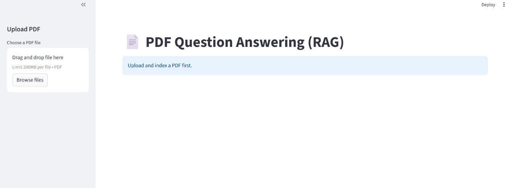
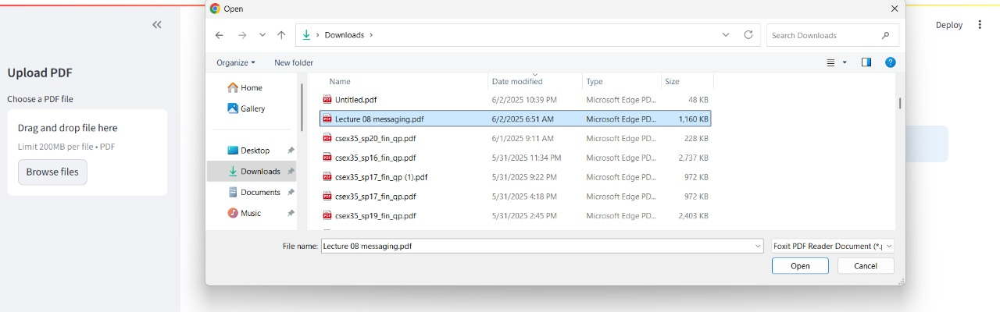
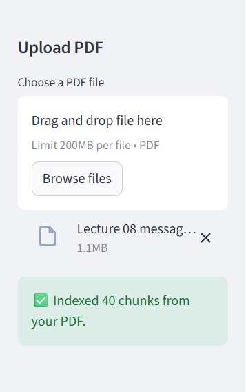
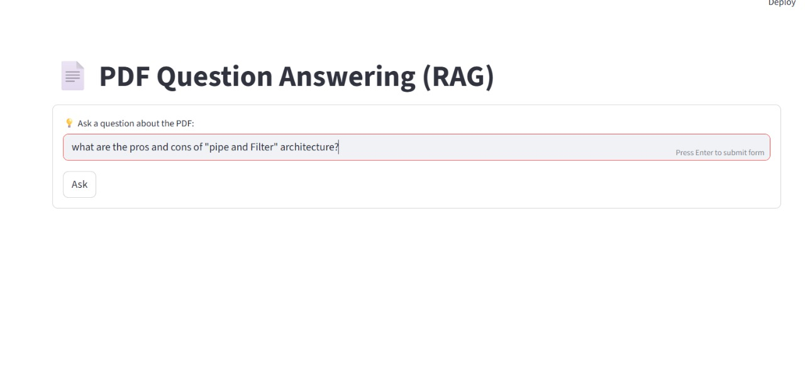
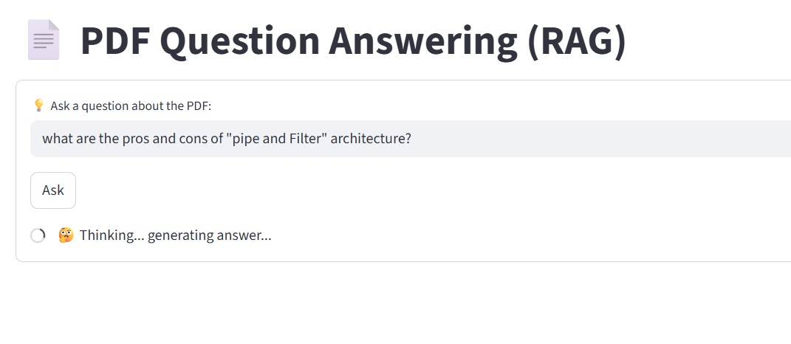
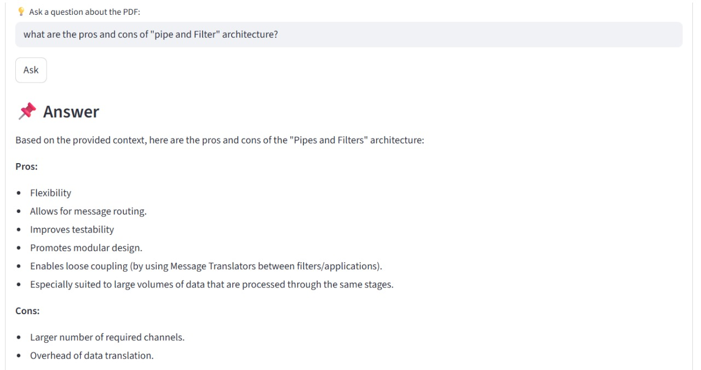

# simple RAG system

## Abstract
Retrival Augmented generation has become a standard in LLMs world. It allows the model to access a non-parametric memory that helps it to answer the question in a better and task-specific way.

---
## Implementation

to explore this beautiful world I have made a simple RAG system that

- takes a pdf from user
- splitting it to chunks while keeping text overlapping for context
- embedding chunks via an embedder model
- storing chunks and embeddings in FAISS vector store
- searching in them to answer user queries
- put the top 4 relevant chunks in the prompt for LLM to guide it for best answer

---
## Tech stack

- python
- langchain
- streamlit

---
## images 

---

Done by Mahmoud Abdulghany

